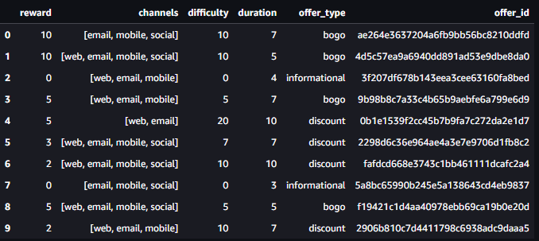
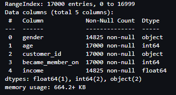
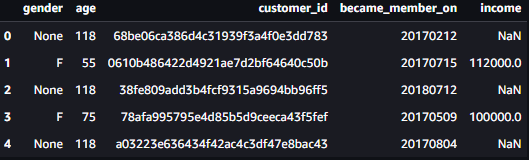
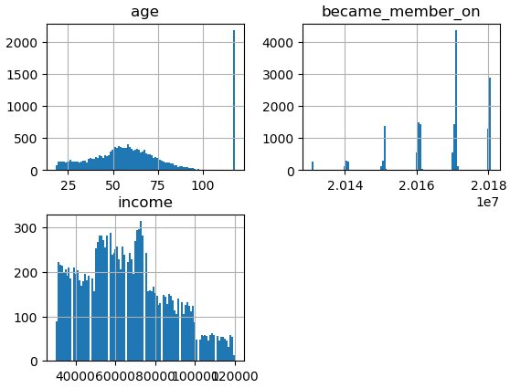
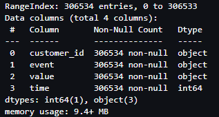
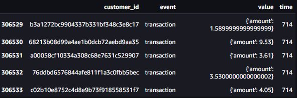
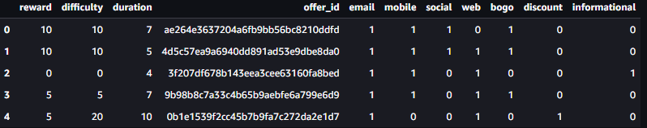
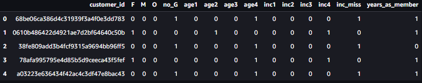
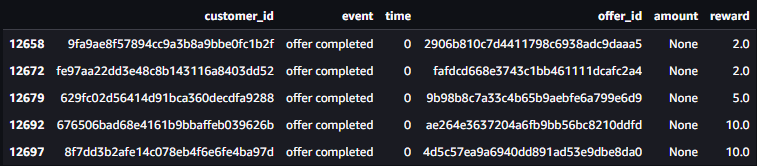

# Submission Information
Author: Tim Gorman  
Project: Starbucks Capstone Challenge

# Definition
This section will provide background on the project, a description of hte problem statement and the proposed solution.
## Project Overview
As part of the Udacity Machine Learning Engineer Course, Starbucks has provided a data science experiment for us to attempt.  This experiment is about understanding what the best offer is for each customer demographic that can be found in the Starbucks app at an invidualized, personalized level. The way that the challenge is presented leaves the door open for different approaches to this challenge. For example, I could build a machine learning model that predicts how much someone will spend based on demographics and offer type, I could build a model that predicts whether or not someone will respond to an offer, or I could decide not to build a machine learning model at all and instead define something like a rules engine.

Generally speaking, this project falls under marketing analytics which is the field of optimizing marketing campaigns for increased return on marketing investment. This interests me because marketing analytics is part of my everyday job at Huntington National Bank (HNB). In my role at HNB, I support model building and model deployment for marketing campaigns. Tackling this project will provide me with relevant experience to the problems I'm faced with every day at work. 

The data is provided in the AWS Starbucks Capstone Challenge work space. The data is contained in three files:
* portfolio.json - containing offer ids and meta data about each offer (duration, type, etc.)
* profile.json - demographic data for each customer
* transcript.json - records for transactions, offers received, offers viewed, and offers completed

Here is the schema and explanation of each variable in the files:

* portfolio.json
    * id (string) - offer id
    * offer_type (string) - type of offer ie BOGO, discount, informational
    * difficulty (int) - minimum required spend to complete an offer
    * reward (int) - reward given for completing an offer
    * duration (int) - time for offer to be open, in days
    * channels (list of strings)
* profile.json
    * age (int) - age of the customer
    * became_member_on (int) - date when customer created an app account
    * gender (str) - gender of the customer (note some entries contain 'O' for other rather than M or F)
    * id (str) - customer id
    * income (float) - customer's income
* transcript.json
    * event (str) - record description (ie transaction, offer received, offer viewed, etc.)
    * person (str) - customer id
    * time (int) - time in hours since start of test. The data begins at time t=0
    * value - (dict of strings) - either an offer id or transaction amount depending on the record

To use this data I downloaded it from the provided workspace and uploaded it into my AWS Account for this section of th class.

## Brief Description of Problem
As described in the previous section, there are multiple ways to analyze the Starbucks dataset. For this project, I chose to build a model that predicts whether or not individuals will accept offers presented through the Starbucks app.

## Solution Statement
My solution was developed using Sagemaker Studio in the AWS account associated with this course. After appropriately analyzing and cleaning the data in a notebook,  I split the data into a training sets, validation sets, testing sets. I saved those data sets in S3 to and use them in Sagemaker Training jobs. I used a Sagemaker implementation of a package called [LightGBM](https://lightgbm.readthedocs.io/en/latest/index.html) to predict whether or not individuals will accept the offers presented through the Starbucks app. LightGBM is a gradient boosting framework that uses tree based learning algorithms. Tree based algorithms are well-suited for tabulaur data like in this Starbucks dataset and LightGBM in particular is advantageous because it is designed to be fast, have low memory usage, allow for parallel, distributed, and GPU learning, and handle large-scale data.  I trained and tested the model using sagemaker processing. I then compared this model output to to a logistic regression model and analyzed the results based on the metrics described below

## Metrics
I measured success based on the [AUC score](https://developers.google.com/machine-learning/crash-course/classification/roc-and-auc) (area under the ROC curve). This is an appropriate metric for classification problems that will give me a sense of the false positive and the true positive rate (extractable from the ROC Curve). Beyond that, AUC is a desirable metric for the following reasons: (1) AUC is scale-invariant (doesn't depend on absolute value of scores) and (2)
AUC is classification-threshold-invariant (measures quality of prediction independent of selected classification threshold). I also considered other metrics such as the [F1 Score](https://towardsdatascience.com/the-f1-score-bec2bbc38aa6) and accurracy.

# Data Exploration
My data exploration is all performed in the notebook "01_Exploratory_Data_Analysis". The important aspects of that exploration will be described below.

Before exploring the data the first thing As you can see in above in the [Project Overview Section](#Project-Overview) there are some similar columns between the various data sets but they are not exactly the same so I first normalized names across datasets so that customer ids are "customer_id" and offer_ids are "offer_id". With those column name updates, I will describe the three different datasets below.

## Portfolio
The portfolio dataset contains all 10 different offers presented in the Starbucks app and can be seen below.

Each offer has a differing channels that in can be presented through with differing difficulties, rewards, and durations. The bogos come with the highest rewards and the discoutn comes with the highest difficulty. When we go to actually utilize this data in a model, we'll need to extract the individual channels out of the "channels" column and one-hot encode them.

## Profile
The profile dataset contains the relevant features of customer profiles as can be seen in the image below. "age", "customer_id", and "became_a_member_on" all have non-null values but "gender" and "income" both have null values that will need to be imputed before modeling.

A snapshot of the profile dataset looks like the following.

 
 By inspecting this sample of data we can see that the offer id is hashed like the customer id is from the portfolio dataset, and we can see that gender is presented as a categorical type. One column that stands out is "became_a_member_on", which can be reformed into something like a customer tenure, which I think will have a strong impact on whether or not an offer will be accepted.
 
 We can learn more about our numeric columns by ploting histograms of them, which ar shown below.
 

"age" appears to have a fat tail on the distribution towards teh lower end with faster drop off on the higher end accompanied by a spike at the age of 118. We know that there aren't that many profiles with an age equal to 118 so we will be removing that from our dataset that gets fed into the model.

"became_a_member_on" is grouped by year, which is due to how the date is formatted in the column. Because of this some information is lost but we can still see that there is a peak for the year 2017 and then a drop off as we go further back in time.

"income" appears to have for distinct groupings that we can likely later use to segment the data into different income populations.

## Transcript
Transcript is the largest data set provided with 306534 records provided. All records are populated with no null values as seen below along with a sample of data from the transcript dataset.

The "event" column contains the following kind of events: transaction, offer recieved, offer viewed, and offer completed. This is the main column we will use to identify a successful offer along with the "time" column from this dataset and the "duration" column from the portfolio dataset. In order for an offer to be considered successful it would need to to have an offer recieved, viewed, and then completed within the duration (from the portfolio dataset) of the offer. If the offer is viewed and not completed, then the offer is not succesful, and if the offer is completed and not viewed then the offer is not considered successful.

If we take the difference between the max and the min times from this dataset (time is in hours), we find that the offer trial lasted about 30 days. This gives us a sense of the timescale over which our model predictions will be helpful. If this were a real model, I would think that the refresh timescale of the model (retraining) would maybe be on the order of months or a year becuase our training time window is only one month.

# Algorithms and Techniques

As mentioned in the [Solution Statement](#Solution-Statement), LightGBM is the model that I chose to use in this project. In particular, I have chosen to use the AWS Sagemaker Jumpstart implementation of the LightGBM Algorithm. This implementation allows me to use a pre-trained LightGBM model that easily integrates with sagmeaker training, hyperparameter tuning, and inference without the need to write a series of custom scripts. I also chose to use AWS Sagemaker Jumpstart implementation of the SKLEARN Logistic Regression algorithm. This has all of the benefits that the LighhtGBM implementation has. Using these implementations gives me the full power of Sagemaker with the least amount of setup -- perfect for modeling a new set of data. 
Algorithms and techniques used in the project are thoroughly discussed and properly justified based on the characteristics of the problem.

My expectation for performance is that a hyper-parameter-tuned LightGBM model will be able to achieve a higher ROC AUC score when compared to a simple Logistic Regression Model.

# Methodology

## Data Preprocessing and Feature Engineering
A significant portion of the time for this project was spent on preprocessing the datasets for the LightGBM and Logistic Regression models.  I will first describe how I preprocessed each dataset and then how the were joined, cleaned and labeled. All of these preprocessing and feature engineering steps can be found in the "02_Feature_Generation.ipynb".

### Portfolio
To prepare the portfolio dataset for modeling I decide to one-hot encode both the "offer_type" column and the "channels" column using using the Sci-Kit Learn MultilabelBinarizer method and the Pandas get_dummies method, respectively. A snapshot of the final portfolio dataset is below.

### Profile
To prepare the profile dataset for modeling I decided to do quite a bit of preprocessing. First I filled nulls in "gender" with a "no_G" label and then one-hot encoded the "gender" column. Next I decided to bin and one-hot encoded the "age" column into quartiles that were calculated excluding the spike in counts at 118. This means that I bucketed all customers with age = 118 into the oldest age group, "age4", which I think is an acceptable choice for this clearly incorrect age. In order from youngest to oldest, the 4 age buckets were "age1", "age2", "age3", and "age4". After that I binned and one-hot-encoded the "income" column into 4 buckets from low to high income, inc1, inc2, inc3, inc4, and 1 other bucket, no_inc, for missing income. These groups were based on the 4 groups seen in [profile_hist.png](./images/profile_hist.png). Lastly I decided to reformat the "became_member_on" column into a "years_as_member" column which assumed the current year was 2018. I assumed this beacuse there were no customers that became members in years after 2018. Instead of bucketing "years_as_member" and one-hot encoding it, I decided to keep it as a single column and retain ordinality, which I thought may be an important aspect of this feature for the model. A snapshot of the final profile dataframe can be seen below.

### Transcript

To preprocess the transcript dataset , I had to unpack the value column into separate  columns for "amount", "offer_id", and "reward" and then populate those columns based on the "event" column. For example if the "event" equaled "offer received" then I needed to populate the "offer_id" column with the "offer_id" from the "value" column. Or if the "event" equaled "offer completed" then I needed to populate "offer_id" and "reward" from the "value" column. An example of the transaction dataset where I filtered only to "offer completed" events is seen below.

### Merging
The data was merged by left joining the profile and portfolio datasets to the transcript dataset on "offer_id" and "customer_id" respectively.
### Generating the Target Label
To generate the target label I sorted the merged dataset by "customer_id", "offer_id", and "time". This resulted in a dataset where all transactions for a given customer id where in order of offer id and also in chronological order. This arrangment of the dataset allowed me to search for "sucessful offers", which I did using conditional statemnts and looping over the rows of the dataframe. As a reminder, the criteria for a sucessful offer are the following:

1. an offer was recieved
2. an offer was then viewed
3. an offer was subsequently completed
4. and criteria 2 and 3 were satisfied with the duration of the offer in question.

When a successful offer was found, the associated "offer recieved" record was labeled as "offer_successful" equal to 1, and 0s were assigned to unsuccessful offers.

After labeling the dataset was found to be somewhat imbalanced with 30.5% of records haveing an "offer_successful" label of 1 and 69.5% having and "offer_succesful" label of 0.

### The Final Dataset: Train, Val, Test Split
The columns of the final dataset were filtered down to the following, where "offer_successful" is the target column:

* 'reward',
* 'difficulty',
* 'duration',
* 'email',
* 'mobile',
* 'social',
* 'web',
* 'bogo',
* 'discount',
* 'informational',
* 'F',
* 'M',
* 'O',
* 'no_G',
* 'age1',
* 'age2',
* 'age3',
* 'age4',
* 'inc1',
* 'inc2',
* 'inc3',
* 'inc4',
* 'inc_miss',
* 'years_as_member',
* 'offer_successful'

The only records kept were those for "offer received" events, all other records were dropped because they were not considered relevent or were redundant.

The data was then split into training, validation, and testing datasets using a stratified train-test split method from Sci-Kit Learn with 75% of the data in the training set the remaining 25% split between the testing and validation datasets.
## Implementation
Model training was accomplished in the "03_model_training.ipynb" notebook and the training process therein is described below. 

The process for which metrics, algorithms, and techniques were implemented with the given datasets or input data has been thoroughly documented. Complications that occurred during the coding process are discussed.

## Refinement
The process of improving upon the algorithms and techniques used is clearly documented. Both the initial and final solutions are reported, along with intermediate solutions, if necessary.

# Results

## Model Evaluation and Validation
The final model’s qualities—such as parameters—are evaluated in detail. Some type of analysis is used to validate the robustness of the model’s solution.

## Justification
The final results are compared to the benchmark result or threshold with some type of statistical analysis. Justification is made as to whether the final model and solution is significant enough to have adequately solved the problem.